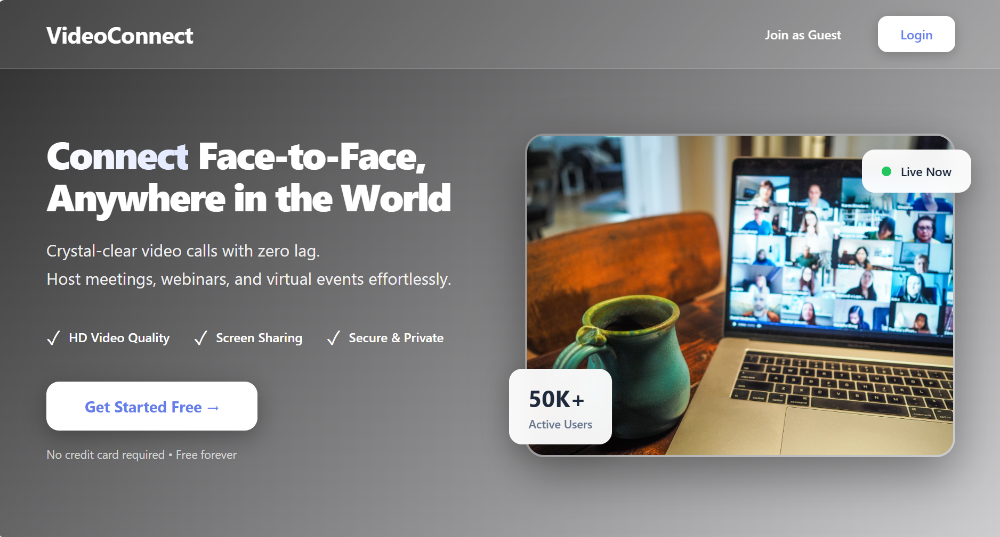
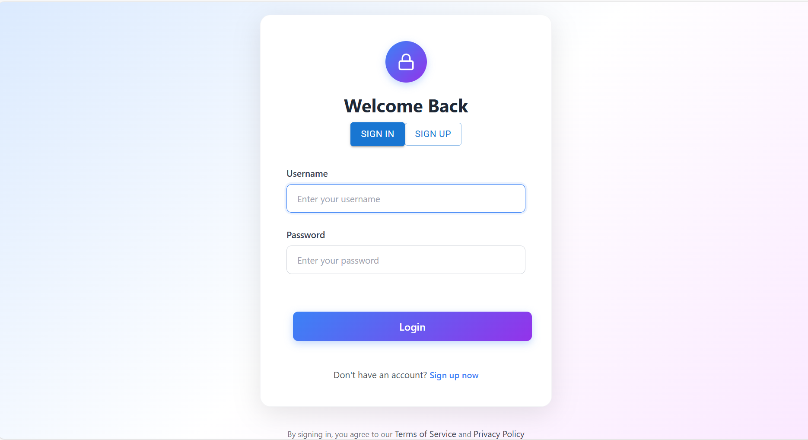
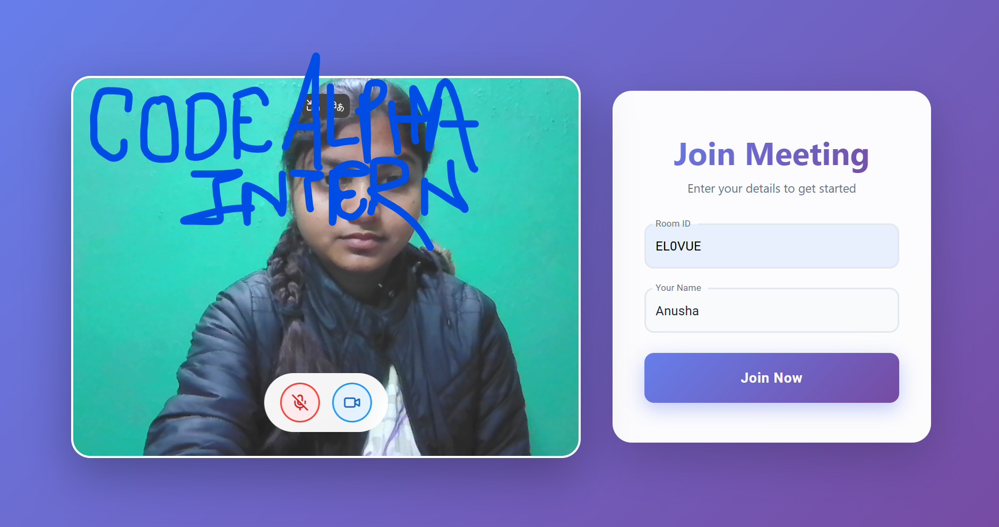
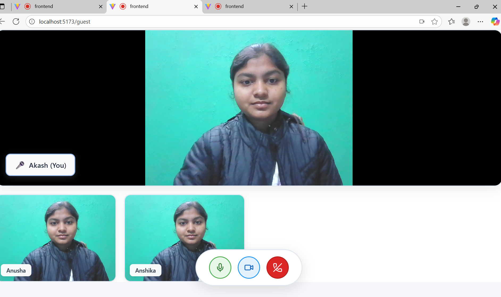
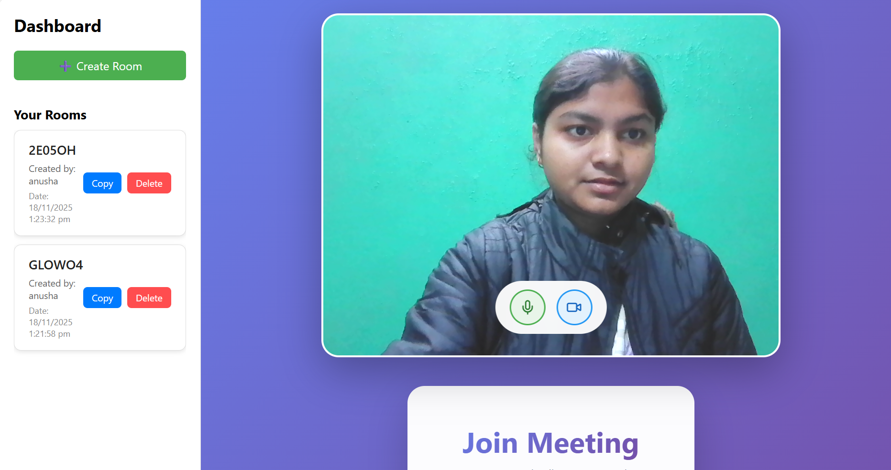
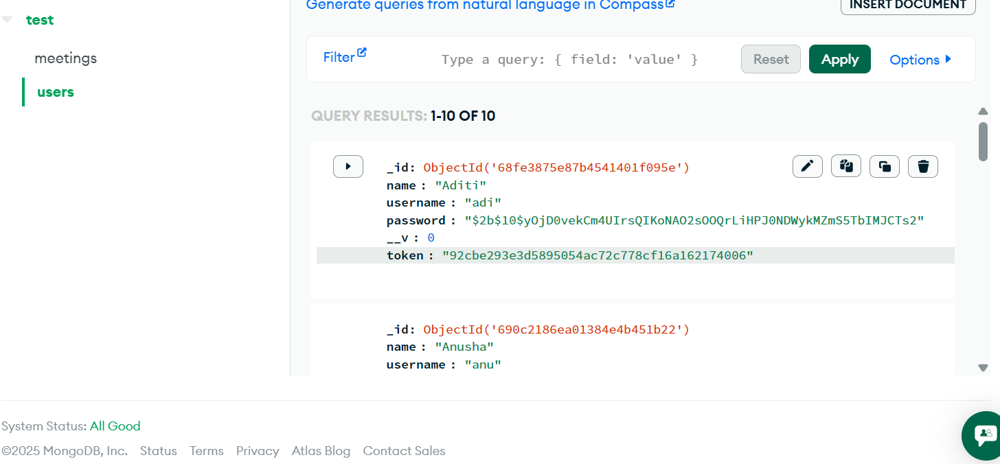

# CodeAlpha Video Conferencing App

 
 

A **real-time video conferencing application** inspired by Zoom, built as part of an internship project at **Code Alpha**. This application allows users to **create, join, and manage video call rooms** with authentication features and guest access.  

---

## 🚀 Features

### **User Authentication**
- Secure login and signup functionality.
- Password-protected accounts for registered users.
- Option to **join as a guest** without creating an account.

### **Room Management**
- **Create a new room** with a specific date and time.
- **Delete a room** if no longer needed.
- **Copy room code** to share with other participants.

### **Video Call Functionality**
- Real-time video and audio communication using **Socket.IO & WebRTC**.
- Responsive layout for both local and remote video feeds.
- Toggle microphone and camera during meetings.

### **User Experience Enhancements**
- Clean and intuitive **Material UI dashboard**.
- Display of **room creator** for each room.
- Works on modern browsers with real-time updates.

---

## 🛠️ Technologies Used

- **Frontend:** React.js, Material UI
- **Backend:** Node.js, Express.js  
- **Database:** MongoDB  
- **Real-Time Communication:** Socket.IO, WebRTC  
- **Authentication:** JWT (JSON Web Tokens)  
- **Stack:** MERN Stack  

---

## 🔗 How It Works

1. **Login / Signup:** Users can register or log in to access the dashboard. Guests can join without an account.  
2. **Dashboard:** Displays all rooms with options to create, delete, or copy room codes.  
3. **Create Room:** Specify a date and time to schedule a meeting.  
4. **Join Room:** Use a room code to connect to an ongoing or scheduled meeting.  
5. **Video Call:** Participants can toggle microphone and camera during the call.  

---

## 📸 Screenshots

  
  
  
  

---

## 📝 Future Improvements

- Add **screen sharing** functionality.  
- Enable **chat within the room**.  
- Implement **recording of meetings**.  
- Integrate **push notifications** for upcoming meetings.  

